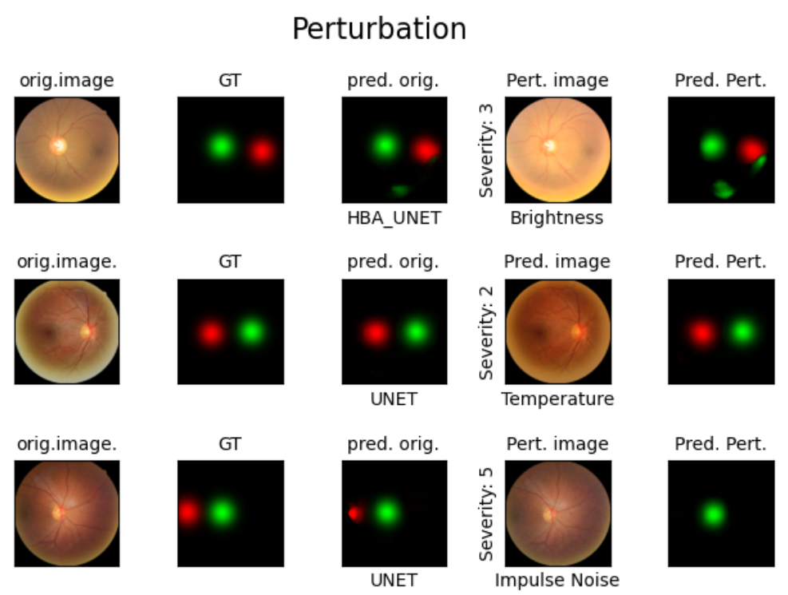

# ARVO-Ophai-Landmarking

This study aims to create a comprehensive benchmark for the evaluation of deep learning methods for the localization of the fovea and disc in fundus images under various perturbations. Such a benchmark is essential for the development of new landmark localization models that can work in different real imaging conditions including brightness, contrast, lens effects, etc.

This repository contains the code and resources for the ARVO abstract for the project described above, from OPHAI Lab (supervised by Dr. Mohammad Eslami, Dr. Saber Kazeminasab, and Dr. Tobias Elze). Instructions for reproducing results and using this repository are below. All files for training, evaluating, and plotting are located in the parent directory. The code for all models we used are in `/models`. The code for data loading, preprocessing, and metrics are found in `/utils`


# Setup
You can use the file `pip install -r requirement.txt` which was tested using Python 3.9.0.

Once you have downloaded the file, run the following command.

```
conda env create --name FundusLandmarking --file=environments.yml
```

# Train a model

The `\models` directory has two models in it, the HBA UNET (https://arxiv.org/abs/2107.04721) and UNET (https://arxiv.org/abs/1505.04597). If you would like to train your own model, you must add it to the `\models` directory and edit the arguements in the `train.py` file. 
```

usage: train.py [-h] --model-name
                     {hbaunet, unet}
                     --train NAME_CSV_TRAIN 
                     --dataset_dir DATA_DIR
                     --save_path PATH_SAVE 
                     --image_size IMG_SIZE
                     

Train model.

optional arguments:
  -h, --help            show this help message and exit
  --model-name {hbaunet, unet}
                        Name of model to train.
  --train NAME_CSV_TRAIN
                        Name of the CSV file with training dataset
                        information.
  --dataset_dir DATA_DIR   Path to the folder with the CSV files and image
                        subfolders.
  --save_path PATH_SAVE
                        Path to the folder where model will be saved.
  --img-size IMG_SIZE   Size to which the images should be reshaped (one
                        number, i.e. 256 or 512).
  
  ```

# Test a model

Use the `test.py` file to test the performance of a trained model on the chosen testing dataset.  
```

usage: test.py [-h] --model-name
                     {hbaunet, unet}
                     --train NAME_CSV_TRAIN 
                     --dataset_dir DATA_DIR
                     --path_trained_model MODEL_PATH
                     --save_path PATH_SAVE 
                     --image_size IMG_SIZE
                     

Test model.

optional arguments:
  -h, --help            show this help message and exit
  --model-name {hbaunet, unet}
                        Name of model to train.
  --test NAME_CSV_TEST
                        Name of the CSV file with training dataset
                        information.
  --dataset_dir DATA_DIR   Path to the folder with the CSV files and image
                        subfolders.
  --path_trained_model MODEL_PATH   Path to the .h5 file of the trained model. 
  --save_path PATH_SAVE
                        Path to the folder where model will be saved.
  --img-size IMG_SIZE   Size to which the images should be reshaped (one
                        number, i.e. 256 or 512).
  
  ```

